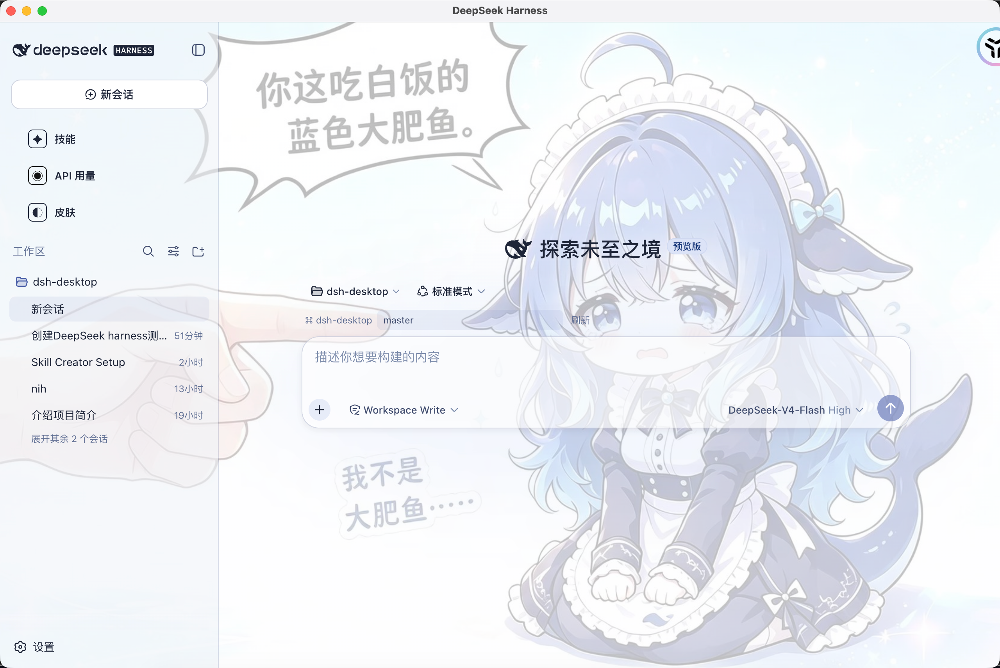
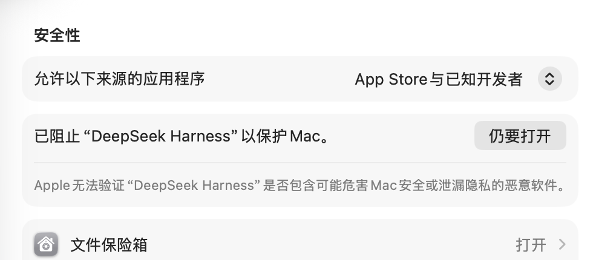
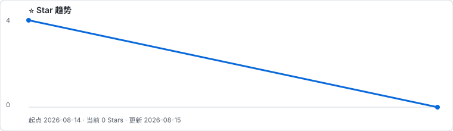
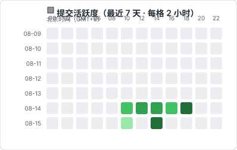

# DeepSeek Harness Desktop

将 [DeepSeek Harness](https://github.com/deepseek-ai/deepseek-harness) 的 Web UI 封装为桌面应用：双击即可启动本地服务并打开界面，关闭窗口后服务可继续在后台运行。

## 🖼️ 参考图片



## ✨ 特性

| 特性 | 说明 |
| --- | --- |
| 一键启动 | 自动启动 `dsh web` 并打开桌面窗口，无需手动开终端。 |
| 托盘常驻 | 关闭窗口仅隐藏到托盘，任务不会中断。 |
| 智能复用 | 3080 端口已有服务时直接复用，不重复启动。 |
| 日志排错 | 启动过程写入 `dsh.log`，方便定位问题。 |
| 技能 | 左栏入口，可通过对话式 `skill-creator` 在当前项目创建并调用 Skill。 |
| API 用量 | 左栏入口，查询 DeepSeek 账号当前余额。 |
| 一键换肤 | 左栏入口，可一键导入、启用和恢复外观皮肤；精选皮肤基于 [dsh-web-ui](https://github.com/zhu1090093659/dsh-web-ui)。 |
| 独立 Mac 应用 | macOS DMG 内置 DSH 和运行时，无需安装 Node.js、npm 或全局 `dsh`。 |
| Windows 安装包 | 可构建 x64 NSIS `.exe` 安装程序。 |

## 📋 环境要求

| 你的目的 | 要求 |
| --- | --- |
| 使用 macOS 安装包 | macOS 11+、Apple Silicon（M1/M2/M3/M4）。 |
| Windows 一键安装 | Windows 10/11、网络，以及源码目录；有 Git 可克隆，没有 Git 可下载源码 ZIP。 |
| 本地开发 | macOS 或 Windows；推荐 Node.js 22.19+ 与 npm。 |
| 构建 macOS DMG | Apple Silicon Mac、Node.js 22.19+、Xcode Command Line Tools、约 2 GB 可用空间。 |

> 💡 Windows 脚本会尝试通过 `winget` 安装 Node.js LTS。没有 `winget` 或安装失败时，请先手动安装 Node.js LTS 再重试。

## 🚀 安装与启动

### 🍎 macOS：下载安装包

> 仅支持 Apple 芯片；暂不支持 Intel Mac。首次运行不需要安装 Node.js 或 `dsh`。

1. 在 [DeepSeek Harness macOS DMG 安装包下载页](https://github.com/wangjicheng2004/dsh-desktop/releases) 下载最新的 `DeepSeek Harness-*-mac-arm64.dmg`。不要下载 `Source code (zip)`，它不能直接安装。
2. 双击 DMG，把 **DeepSeek Harness** 拖入「应用程序（Applications）」，复制完成后弹出磁盘镜像。
3. 从「应用程序」启动 **DeepSeek Harness**。首次启动约需 5–10 秒。

#### 🔐 首次打开提示“无法验证开发者”

当前包使用本地签名但尚未公证。请在「应用程序」中按住 Control 点击应用，选择「打开」；仍被阻止时，到「系统设置 → 隐私与安全性」点击“仍要打开”。



#### 🔄 升级

先从菜单栏鲸鱼图标中选择「退出」，再用新 DMG 替换「应用程序」中的同名应用。不要直接从 DMG 窗口运行，否则容易留下多个同名副本。

#### 🧰 终端校验安装（发布后可用）

适合 Finder 安装不顺利、但愿意使用终端的用户。每个正式 Release 会附带校验过的安装脚本；当前仓库尚未上传 v1.0.4 的 Release 资产时，请不要执行旧仓库的下载命令，而是按下方“本地开发”章节构建。

> 发布后请只从同一条 Release 的说明中复制命令与 SHA-256，避免脚本版本和 DMG 不匹配。安装完成后，仍请按住 Control 点击应用并选择「打开」。

### 🪟 Windows：安装

发布页提供安装包时，下载 `DeepSeek Harness Setup *.exe` 并按安装向导完成安装即可。

尚未提供安装包或需要从源码运行时，可按以下方式一键安装：

1. 获取源码：

   ```sh
   git clone https://gitee.com/wjc18053186786/dsh-desktop
   cd dsh-desktop
   ```

   没有 Git 时，下载并解压 Gitee 的源码 ZIP。

2. 双击 `install.cmd`，保持窗口打开直至完成（通常约 3–5 分钟）。
3. 双击桌面的 **DeepSeek Harness** 快捷方式。

安装脚本会依次检测或安装 Node.js、全局 DSH、项目依赖和 Electron，并创建桌面快捷方式。

> ⚠️ 这是“源码目录安装”，不是 `.exe` / `.msi` 安装包。快捷方式依赖当前源码目录；移动或删除它后，请在新目录重新运行 `install.cmd`。

### 🧰 Windows：手动安装（可选）

适用于不使用 `install.cmd` 的场景。请在 **CMD** 中执行：

```bat
set ELECTRON_MIRROR=https://npmmirror.com/mirrors/electron/
npm ci --registry=https://registry.npmmirror.com
powershell -NoProfile -ExecutionPolicy Bypass -File create-shortcut.ps1
```

## 🧭 使用

1. 打开应用，等待窗口加载。
2. 在 **设置 → 模型** 填入 [DeepSeek API Key](https://platform.deepseek.com)。
3. 选择工作目录并新建会话。

| 操作 | 效果 |
| --- | --- |
| 关闭窗口 | 隐藏到系统托盘，服务继续运行。 |
| 单击托盘图标 | 重新打开窗口。 |
| 托盘菜单 → 退出 | 停止服务并退出应用。 |
| 左栏 → 技能 | 点击“开始创建 Skill”复制 `/skill-creator`，在对话中说明需求。创建器会确认需求后默认把新 Skill 写入当前项目 `.dsh/skills`；没有本地工作区时才写入本机 DSH Home。随后在输入框键入 `/` 调用。 |
| 首次配置 | API 地址留空即使用 DeepSeek 官方地址；使用中转站时填写其 OpenAI 兼容根地址（可含 `/v1`，不要填写 `/chat/completions`）。 |
| 左栏 → API 用量 | 查询当前 DeepSeek 账号余额；密钥只在 Electron 主进程中读取，不会暴露给网页。 |
| 左栏 → 皮肤 | 可一键导入并启用精选的 [dsh-web-ui](https://github.com/zhu1090093659/dsh-web-ui) 外观皮肤，也可导入 CSS 或可信 DSH 插件皮肤。切换插件皮肤时应用会自动重启 DSH。 |

> DeepSeek 公开接口提供的是账号余额，而非单个 API Key 的实时历史用量；按 Key 的明细需要到开放平台 Usage 页面导出。详见 [余额接口文档](https://api-docs.deepseek.com/zh-cn/api/get-user-balance) 与 [官方 FAQ](https://api-docs.deepseek.com/faq)。

### 🎨 皮肤安全说明

- **精选外观皮肤**：客户端提供基于 [zhu1090093659/dsh-web-ui](https://github.com/zhu1090093659/dsh-web-ui) 的可选皮肤。选择后才会下载、导入并启用，不会在未确认时自动执行。
- **CSS 皮肤**：只包含样式，可直接导入并即时切换。
- **DSH 插件皮肤**：兼容 [dsh-deep-whale](https://github.com/Small-tailqwq/dsh-deep-whale) 这类带有 `skin.json`、`package.json`、`cordis.patch.yml` 和 `lib/client.js` 的包。它们会执行自带客户端脚本，务必仅导入可信来源；启用时会写入本地 web profile 并重启 DSH。
- **许可与信任**：不同皮肤及其素材可能采用不同许可证。导入、分发或二次修改前，请查看所选皮肤目录中的 `LICENSE` 和 `package.json`；DSH 插件会执行客户端脚本，只应启用可信来源。
- 皮肤及状态保存在应用自身的 DSH Home 中：macOS 位于 `~/Library/Application Support/dsh-desktop/dsh`，Windows 位于 `%APPDATA%\\dsh-desktop\\dsh`。

## 🔧 排错

| 现象 | 处理方式 |
| --- | --- |
| macOS 首次无法打开 | 按住 Control 点击应用并选择「打开」；必要时在「隐私与安全性」点击“仍要打开”。 |
| macOS 提示服务已退出或白屏 | 退出后重开；仍有问题时查看 `~/Library/Application Support/dsh-desktop/dsh.log`。 |
| Windows 双击快捷方式没反应 | 查看 `%APPDATA%\dsh-desktop\dsh.log`，确认源码目录和其中的 `node_modules` 还在。 |
| 服务未就绪超时 | 确认 3080 端口没有被其他程序占用，再重新启动。 |
| 出现多个同名应用 | 退出全部实例，删除旧副本和已挂载的旧 DMG，只从「应用程序」启动最新版。 |

## 🛠️ 开发与构建

### 💻 本地开发（macOS / Windows）

`npm ci` 会根据 `package-lock.json` 安装锁定版本的 Electron 和 DSH。

```sh
npm ci
npm start
```

Windows 下载较慢时，可先在 CMD 中执行：

```bat
set ELECTRON_MIRROR=https://npmmirror.com/mirrors/electron/
```

### 📦 构建 macOS DMG

先安装 Xcode Command Line Tools：

```sh
xcode-select --install
```

然后在项目根目录运行：

```sh
npm ci
npm run dist:mac
```

产物：

- `dist/DeepSeek Harness-<version>-mac-arm64.dmg`：可发布的安装包。
- `dist/mac-arm64/DeepSeek Harness.app`：用于本机调试的应用目录。

只生成 `.app` 时运行 `npm run package:mac`。当前构建的是未签名的 Apple Silicon 安装包。

### 🪟 构建 Windows 安装包

必须在 **Windows x64** 机器或 Windows x64 GitHub Actions runner 中运行：

```sh
npm ci
npm run package:win
```

产物位于 `dist/`，为 x64 NSIS 安装程序。不要发布在 macOS 上交叉构建出的 `.exe`：它可能缺少 Windows 原生依赖。仓库的 `Verify desktop builds` 工作流会在 Windows 上执行 `npm ci`、测试与安装包构建；正式发布前仍应在 Windows 10/11 实机安装验证。

### ✅ 自动测试

```sh
npm test
```

覆盖本机 Skill 的创建/浏览，以及 CSS 与 DSH 插件皮肤的导入、启用、移除等状态逻辑。

## 📄 License

[MIT](LICENSE)

## 🙏 致谢

- [DeepSeek Harness](https://github.com/deepseek-ai/deepseek-harness)
- [Electron](https://www.electronjs.org/)
- [dsh-web-ui](https://github.com/zhu1090093659/dsh-web-ui)（精选外观皮肤来源）

## 📈 项目动态

[](https://github.com/wangjicheng2004/dsh-desktop/stargazers)




